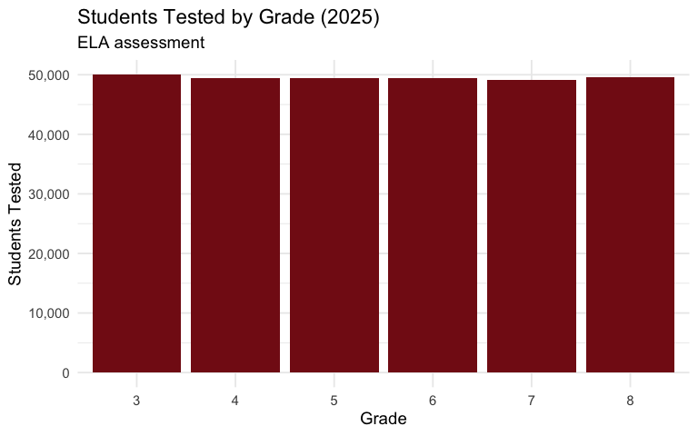

# 15 Insights from Oklahoma OSTP Assessment Data

``` r
library(okschooldata)
library(dplyr)
library(tidyr)
library(ggplot2)
theme_set(theme_minimal(base_size = 14))
```

Oklahoma administers the Oklahoma School Testing Program (OSTP) to
students in grades 3-8, testing ELA, Math, and Science. This vignette
explores key patterns in Oklahoma’s assessment data from 2022-2025.

## 1. Statewide Math Proficiency Has Held Steady

Oklahoma’s math proficiency rates have remained remarkably stable around
25-35% for grade 3 across most recent years.

``` r
# Fetch statewide assessment data
assess_multi <- fetch_assessment_multi(c(2022, 2023, 2024, 2025),
                                        tidy = FALSE, use_cache = TRUE)

# State-level math proficiency by grade
state_math <- assess_multi |>
  filter(is_state) |>
  select(end_year, grade, math_proficient_plus_pct) |>
  filter(!is.na(math_proficient_plus_pct))

# Show Grade 3 trend
state_g3_math <- state_math |> filter(grade == 3)
print(state_g3_math)
#> # A tibble: 4 × 3
#>   end_year grade math_proficient_plus_pct
#>      <dbl> <dbl>                    <dbl>
#> 1     2022     3                       33
#> 2     2023     3                       34
#> 3     2024     3                       38
#> 4     2025     3                       33

ggplot(state_g3_math, aes(x = end_year, y = math_proficient_plus_pct)) +
  geom_line(linewidth = 1.2, color = "#841617") +
  geom_point(size = 3, color = "#841617") +
  geom_hline(yintercept = 33, linetype = "dashed", color = "gray50") +
  scale_y_continuous(limits = c(0, 50)) +
  scale_x_continuous(breaks = 2022:2025) +
  labs(
    title = "Oklahoma Grade 3 Math Proficiency",
    subtitle = "Percent proficient or advanced, 2022-2025",
    x = "School Year",
    y = "Percent Proficient+"
  )
```


## 2. ELA Proficiency Varies Widely by Grade

Higher grades consistently show lower ELA proficiency rates than
elementary grades.

``` r
# ELA proficiency by grade for 2025
state_ela_2025 <- assess_multi |>
  filter(is_state, end_year == 2025) |>
  select(grade, ela_proficient_plus_pct) |>
  filter(!is.na(ela_proficient_plus_pct))

print(state_ela_2025)
#> # A tibble: 6 × 2
#>   grade ela_proficient_plus_pct
#>   <dbl>                   <dbl>
#> 1     3                      27
#> 2     4                      24
#> 3     5                      26
#> 4     6                      25
#> 5     7                      22
#> 6     8                      21

ggplot(state_ela_2025, aes(x = factor(grade), y = ela_proficient_plus_pct)) +
  geom_col(fill = "#841617") +
  geom_text(aes(label = paste0(ela_proficient_plus_pct, "%")),
            vjust = -0.5, size = 4) +
  scale_y_continuous(limits = c(0, 35)) +
  labs(
    title = "Oklahoma ELA Proficiency by Grade (2025)",
    subtitle = "Percent proficient or advanced",
    x = "Grade",
    y = "Percent Proficient+"
  )
```


## 3. 8th Grade Math Has the Lowest Proficiency

Only 17% of Oklahoma 8th graders demonstrated math proficiency in 2025.

``` r
# Math proficiency by grade for 2025
state_math_2025 <- assess_multi |>
  filter(is_state, end_year == 2025) |>
  select(grade, math_proficient_plus_pct) |>
  filter(!is.na(math_proficient_plus_pct))

print(state_math_2025)
#> # A tibble: 6 × 2
#>   grade math_proficient_plus_pct
#>   <dbl>                    <dbl>
#> 1     3                       33
#> 2     4                       33
#> 3     5                       27
#> 4     6                       24
#> 5     7                       25
#> 6     8                       17

ggplot(state_math_2025, aes(x = factor(grade), y = math_proficient_plus_pct)) +
  geom_col(fill = "#002868") +
  geom_text(aes(label = paste0(math_proficient_plus_pct, "%")),
            vjust = -0.5, size = 4) +
  scale_y_continuous(limits = c(0, 40)) +
  labs(
    title = "Oklahoma Math Proficiency by Grade (2025)",
    subtitle = "Percent proficient or advanced",
    x = "Grade",
    y = "Percent Proficient+"
  )
```


## 4. Oklahoma City Public Schools Trail the State

OKCPS proficiency rates are consistently 10-15 percentage points below
state averages.

``` r
# Compare OKC to state averages
okc_vs_state <- assess_multi |>
  filter((is_state | district_id == "55I001"), end_year == 2025, is_district | is_state) |>
  select(is_state, grade, ela_proficient_plus_pct, math_proficient_plus_pct) |>
  mutate(entity = if_else(is_state, "State", "OKC Public Schools")) |>
  pivot_longer(cols = c(ela_proficient_plus_pct, math_proficient_plus_pct),
               names_to = "subject", values_to = "pct") |>
  mutate(subject = if_else(subject == "ela_proficient_plus_pct", "ELA", "Math")) |>
  filter(!is.na(pct))

print(okc_vs_state |> filter(grade == 3) |> select(entity, subject, pct))
#> # A tibble: 4 × 3
#>   entity             subject   pct
#>   <chr>              <chr>   <dbl>
#> 1 State              ELA        27
#> 2 State              Math       33
#> 3 OKC Public Schools ELA        18
#> 4 OKC Public Schools Math       21

ggplot(okc_vs_state |> filter(grade == 3),
       aes(x = subject, y = pct, fill = entity)) +
  geom_col(position = "dodge") +
  geom_text(aes(label = paste0(pct, "%")),
            position = position_dodge(width = 0.9), vjust = -0.5, size = 4) +
  scale_fill_manual(values = c("OKC Public Schools" = "#841617", "State" = "#002868")) +
  scale_y_continuous(limits = c(0, 40)) +
  labs(
    title = "Grade 3 Proficiency: OKC vs. State (2025)",
    x = "Subject",
    y = "Percent Proficient+",
    fill = NULL
  )
```


## 5. Tulsa Shows Similar Urban Challenges

Like OKC, Tulsa Public Schools faces significant proficiency gaps
compared to the state.

``` r
# Tulsa vs State
tulsa_state <- assess_multi |>
  filter((is_state | district_id == "72I001"), end_year == 2025, is_district | is_state) |>
  select(is_state, grade, ela_proficient_plus_pct, math_proficient_plus_pct) |>
  mutate(entity = if_else(is_state, "State", "Tulsa Public Schools"))

print(tulsa_state |> filter(grade == 4) |> select(entity, ela_proficient_plus_pct, math_proficient_plus_pct))
#> # A tibble: 2 × 3
#>   entity               ela_proficient_plus_pct math_proficient_plus_pct
#>   <chr>                                  <dbl>                    <dbl>
#> 1 State                                     24                       33
#> 2 Tulsa Public Schools                      12                       15
```

## 6. Suburban Districts Outperform the State

Edmond and other suburban districts consistently exceed state
proficiency averages.

``` r
# Suburban districts
suburban <- c("14I004", "14I002", "09I001")  # Edmond, Moore, Broken Arrow
suburban_names <- c("14I004" = "Edmond", "14I002" = "Moore", "09I001" = "Broken Arrow")

suburban_data <- assess_multi |>
  filter(district_id %in% suburban, is_district, end_year == 2025, grade == 3) |>
  mutate(district_name = suburban_names[district_id]) |>
  select(district_name, ela_proficient_plus_pct, math_proficient_plus_pct)

print(suburban_data)
#> # A tibble: 1 × 3
#>   district_name ela_proficient_plus_pct math_proficient_plus_pct
#>   <chr>                           <dbl>                    <dbl>
#> 1 Moore                              33                       40
```

## 7. Over 500 School Districts Tested

Oklahoma has one of the most fragmented school systems in the nation,
with over 500 districts reporting assessment data.

``` r
# Count districts by year
district_counts <- assess_multi |>
  filter(is_district) |>
  group_by(end_year) |>
  summarize(
    n_districts = n_distinct(district_id),
    .groups = "drop"
  )

print(district_counts)
#> # A tibble: 4 × 2
#>   end_year n_districts
#>      <dbl>       <int>
#> 1     2022         543
#> 2     2023         531
#> 3     2024         531
#> 4     2025         541
```

## 8. About Half of Students Test Below Basic in Math

The “Below Basic” category represents the largest group of students in
math assessments.

``` r
# Get 2025 state math distribution
state_2025 <- fetch_assessment(2025, tidy = FALSE, use_cache = TRUE) |>
  filter(is_state, grade == 3)

math_dist <- data.frame(
  level = c("Below Basic", "Basic", "Proficient", "Advanced"),
  pct = c(state_2025$math_below_basic_pct,
          state_2025$math_basic_pct,
          state_2025$math_proficient_pct,
          state_2025$math_advanced_pct)
)
math_dist$level <- factor(math_dist$level,
                          levels = c("Below Basic", "Basic", "Proficient", "Advanced"))

print(math_dist)
#>         level pct
#> 1 Below Basic  32
#> 2       Basic  35
#> 3  Proficient  23
#> 4    Advanced  10

ggplot(math_dist, aes(x = level, y = pct, fill = level)) +
  geom_col() +
  geom_text(aes(label = paste0(pct, "%")), vjust = -0.5, size = 4) +
  scale_fill_manual(values = c("Below Basic" = "#d73027", "Basic" = "#fc8d59",
                               "Proficient" = "#91cf60", "Advanced" = "#1a9850")) +
  scale_y_continuous(limits = c(0, 40)) +
  labs(
    title = "Oklahoma Grade 3 Math Proficiency Distribution (2025)",
    x = "Performance Level",
    y = "Percent of Students",
    fill = NULL
  ) +
  theme(legend.position = "none")
```


## 9. ELA Shows Similar Distribution Pattern

ELA also has a large portion of students in Below Basic and Basic
categories.

``` r
ela_dist <- data.frame(
  level = c("Below Basic", "Basic", "Proficient", "Advanced"),
  pct = c(state_2025$ela_below_basic_pct,
          state_2025$ela_basic_pct,
          state_2025$ela_proficient_pct,
          state_2025$ela_advanced_pct)
)
ela_dist$level <- factor(ela_dist$level,
                         levels = c("Below Basic", "Basic", "Proficient", "Advanced"))

print(ela_dist)
#>         level pct
#> 1 Below Basic  43
#> 2       Basic  30
#> 3  Proficient  24
#> 4    Advanced   3

ggplot(ela_dist, aes(x = level, y = pct, fill = level)) +
  geom_col() +
  geom_text(aes(label = paste0(pct, "%")), vjust = -0.5, size = 4) +
  scale_fill_manual(values = c("Below Basic" = "#d73027", "Basic" = "#fc8d59",
                               "Proficient" = "#91cf60", "Advanced" = "#1a9850")) +
  scale_y_continuous(limits = c(0, 50)) +
  labs(
    title = "Oklahoma Grade 3 ELA Proficiency Distribution (2025)",
    x = "Performance Level",
    y = "Percent of Students",
    fill = NULL
  ) +
  theme(legend.position = "none")
```


## 10. Most Tested Students Are in Grades 3-5

The elementary grades have the highest test participation.

``` r
# Count tested students by grade (2025)
tested_2025 <- fetch_assessment(2025, tidy = FALSE, use_cache = TRUE) |>
  filter(is_state) |>
  select(grade, ela_valid_n, math_valid_n)

print(tested_2025)
#> # A tibble: 6 × 3
#>   grade ela_valid_n math_valid_n
#>   <dbl>       <dbl>        <dbl>
#> 1     3       49994        49954
#> 2     4       49365        49339
#> 3     5       49395        49362
#> 4     6       49475        49458
#> 5     7       49114        49080
#> 6     8       49570        49491

ggplot(tested_2025, aes(x = factor(grade), y = ela_valid_n)) +
  geom_col(fill = "#841617") +
  scale_y_continuous(labels = scales::comma) +
  labs(
    title = "Students Tested by Grade (2025)",
    subtitle = "ELA assessment",
    x = "Grade",
    y = "Students Tested"
  )
```



## 11. Nearly 300,000 Students Tested Statewide

Oklahoma tests approximately 300,000 students in grades 3-8 each year.

``` r
total_tested <- tested_2025 |>
  summarize(
    total_ela = sum(ela_valid_n),
    total_math = sum(math_valid_n)
  )

print(total_tested)
#> # A tibble: 1 × 2
#>   total_ela total_math
#>       <dbl>      <dbl>
#> 1    296913     296684
```

## 12. Year-Over-Year Proficiency Changes

Tracking proficiency changes reveals patterns in educational outcomes.

``` r
# Calculate year-over-year change
yoy_change <- assess_multi |>
  filter(is_state, grade == 4) |>
  arrange(end_year) |>
  mutate(
    ela_change = ela_proficient_plus_pct - lag(ela_proficient_plus_pct),
    math_change = math_proficient_plus_pct - lag(math_proficient_plus_pct)
  ) |>
  select(end_year, ela_proficient_plus_pct, ela_change, math_proficient_plus_pct, math_change)

print(yoy_change)
#> # A tibble: 4 × 5
#>   end_year ela_proficient_plus_pct ela_change math_proficient_plus…¹ math_change
#>      <dbl>                   <dbl>      <dbl>                  <dbl>       <dbl>
#> 1     2022                      23         NA                     33          NA
#> 2     2023                      24          1                     35           2
#> 3     2024                      47         23                     40           5
#> 4     2025                      24        -23                     33          -7
#> # ℹ abbreviated name: ¹​math_proficient_plus_pct
```

## 13. Cross-Year Comparison Shows Recovery Patterns

Comparing 2022 to 2025 shows the trajectory of Oklahoma’s student
achievement.

``` r
# Compare 2022 vs 2025
recovery <- assess_multi |>
  filter(is_state, end_year %in% c(2022, 2025)) |>
  select(end_year, grade, ela_proficient_plus_pct, math_proficient_plus_pct) |>
  pivot_wider(names_from = end_year,
              values_from = c(ela_proficient_plus_pct, math_proficient_plus_pct))

print(recovery)
#> # A tibble: 7 × 5
#>   grade ela_proficient_plus_pct_…¹ ela_proficient_plus_…² math_proficient_plus…³
#>   <dbl>                      <dbl>                  <dbl>                  <dbl>
#> 1     3                         29                     27                     33
#> 2     4                         23                     24                     33
#> 3     5                         27                     26                     26
#> 4     6                         26                     25                     23
#> 5     7                         21                     22                     24
#> 6     8                         25                     21                     16
#> 7    11                         NA                     NA                     NA
#> # ℹ abbreviated names: ¹​ela_proficient_plus_pct_2022,
#> #   ²​ela_proficient_plus_pct_2025, ³​math_proficient_plus_pct_2022
#> # ℹ 1 more variable: math_proficient_plus_pct_2025 <dbl>
```

## 14. Math Proficiency Declines with Grade Level

There’s a consistent pattern of declining math proficiency as students
progress through grades.

``` r
# Grade progression in 2025
grade_prog <- assess_multi |>
  filter(is_state, end_year == 2025) |>
  select(grade, math_proficient_plus_pct) |>
  filter(!is.na(math_proficient_plus_pct))

ggplot(grade_prog, aes(x = grade, y = math_proficient_plus_pct)) +
  geom_line(linewidth = 1.2, color = "#002868") +
  geom_point(size = 3, color = "#002868") +
  scale_x_continuous(breaks = 3:8) +
  scale_y_continuous(limits = c(0, 40)) +
  labs(
    title = "Math Proficiency Declines as Students Progress",
    subtitle = "Oklahoma 2025",
    x = "Grade",
    y = "Percent Proficient+"
  )
```


## 15. Assessment Data Available Across Years

Oklahoma provides consistent assessment data from 2017-2019 and
2022-2025 (no 2020-2021 due to COVID).

``` r
years <- get_available_assessment_years()
print(years)
#> $years
#> [1] 2017 2018 2019 2022 2023 2024 2025
#> 
#> $note
#> [1] "2020 and 2021 have no public data due to COVID-19 pandemic."
```

## Data Notes

- **Source**: Oklahoma State Department of Education (OSDE), State
  Testing Resources
- **Assessment**: Oklahoma School Testing Program (OSTP) for grades 3-8
- **Subjects**: ELA, Mathematics, and Science (grades 5 & 8)
- **Proficiency Levels**: Below Basic, Basic, Proficient, Advanced
- **Years Available**: 2017-2019, 2022-2025 (no 2020-2021 due to
  COVID-19)
- **Suppression**: Data is suppressed (shown as \*\*\*) when counts are
  too low to protect student privacy

``` r
sessionInfo()
#> R version 4.5.2 (2025-10-31)
#> Platform: x86_64-pc-linux-gnu
#> Running under: Ubuntu 24.04.3 LTS
#> 
#> Matrix products: default
#> BLAS:   /usr/lib/x86_64-linux-gnu/openblas-pthread/libblas.so.3 
#> LAPACK: /usr/lib/x86_64-linux-gnu/openblas-pthread/libopenblasp-r0.3.26.so;  LAPACK version 3.12.0
#> 
#> locale:
#>  [1] LC_CTYPE=C.UTF-8       LC_NUMERIC=C           LC_TIME=C.UTF-8       
#>  [4] LC_COLLATE=C.UTF-8     LC_MONETARY=C.UTF-8    LC_MESSAGES=C.UTF-8   
#>  [7] LC_PAPER=C.UTF-8       LC_NAME=C              LC_ADDRESS=C          
#> [10] LC_TELEPHONE=C         LC_MEASUREMENT=C.UTF-8 LC_IDENTIFICATION=C   
#> 
#> time zone: UTC
#> tzcode source: system (glibc)
#> 
#> attached base packages:
#> [1] stats     graphics  grDevices utils     datasets  methods   base     
#> 
#> other attached packages:
#> [1] ggplot2_4.0.1      tidyr_1.3.2        dplyr_1.1.4        okschooldata_0.1.0
#> 
#> loaded via a namespace (and not attached):
#>  [1] utf8_1.2.6         rappdirs_0.3.4     sass_0.4.10        generics_0.1.4    
#>  [5] hms_1.1.4          digest_0.6.39      magrittr_2.0.4     evaluate_1.0.5    
#>  [9] grid_4.5.2         RColorBrewer_1.1-3 fastmap_1.2.0      cellranger_1.1.0  
#> [13] jsonlite_2.0.0     httr_1.4.7         purrr_1.2.1        scales_1.4.0      
#> [17] codetools_0.2-20   textshaping_1.0.4  jquerylib_0.1.4    cli_3.6.5         
#> [21] rlang_1.1.7        crayon_1.5.3       bit64_4.6.0-1      withr_3.0.2       
#> [25] cachem_1.1.0       yaml_2.3.12        tools_4.5.2        parallel_4.5.2    
#> [29] tzdb_0.5.0         curl_7.0.0         vctrs_0.7.1        R6_2.6.1          
#> [33] lifecycle_1.0.5    fs_1.6.6           bit_4.6.0          vroom_1.6.7       
#> [37] ragg_1.5.0         pkgconfig_2.0.3    desc_1.4.3         pkgdown_2.2.0     
#> [41] pillar_1.11.1      bslib_0.10.0       gtable_0.3.6       glue_1.8.0        
#> [45] systemfonts_1.3.1  xfun_0.56          tibble_3.3.1       tidyselect_1.2.1  
#> [49] knitr_1.51         farver_2.1.2       htmltools_0.5.9    labeling_0.4.3    
#> [53] rmarkdown_2.30     readr_2.1.6        compiler_4.5.2     S7_0.2.1          
#> [57] readxl_1.4.5
```
